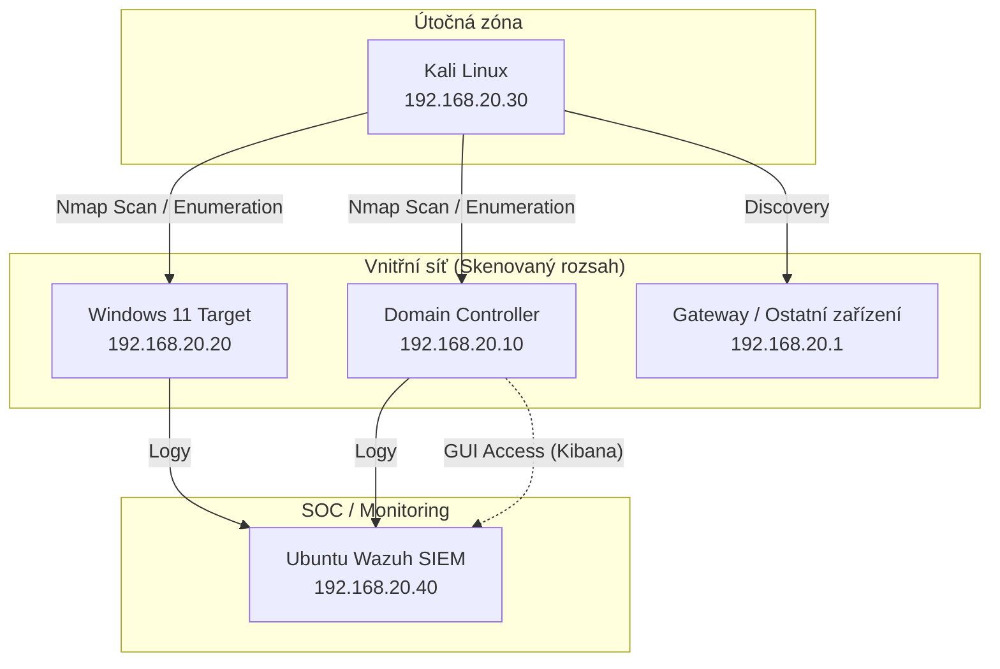

# 🛡️ Home SOC & Detection Lab

### 🧠 Cybersecurity Training Environment

Tento projekt dokumentuje stavbu a provoz **domácího bezpečnostního labu**, který slouží pro simulaci útoků, analýzu logů a nastavování detekčních pravidel v SIEM.

Lab je vytvořen pro trénink dovedností potřebných pro roli **SOC Analyst / Blue Team** – zejména:

* detekci podezřelých aktivit
* analýzu bezpečnostních logů
* práci se SIEM platformou
* simulaci útoků v kontrolovaném prostředí

---

# 🏗️ Lab Architecture

Virtuální prostředí obsahuje útočný stroj, pracovní stanici, serverovou infrastrukturu a centrální SIEM pro monitoring a analýzu logů.

---

# 🧩 Lab Components

### 🥷 Kali Linux

Simulace útoků a bezpečnostní testování.

### 💻 Windows Workstation

Generování telemetrie a testování detekčních pravidel.

### 🖥️ Windows Server

Serverová infrastruktura a zdroj bezpečnostních logů.

### 🖥️Ubuntu 22.04 LTS Server

centrální bod pro sběr a vyhodnocování bezpečnostních událostí.

### 📊 Wazuh SIEM

Centrální bod pro sběr a vyhodnocování bezpečnostních událostí. Hostuje kompletní infrastrukturu SIEMu.

---

# 🔧 Technologies

* VMware
* Kali Linux
* Windows
* Wazuh SIEM
* Sysmon
* Atomic Red Team

---

## 📂 Project Sections

- [Lab Architecture](architecture/lab-environment.md)
- [Attack Simulations](attacks/)
- [Detection Rules](detections/)
- [Notes](notes/)

---

# 🎯 Goal

Cílem tohoto projektu je budovat praktické zkušenosti v oblasti **Security Operations (SOC)**, detekce hrozeb a analýzy bezpečnostních incidentů.

Projekt slouží jako součást mého **cybersecurity learning portfolia**.

Cílem tohoto projektu je postupně budovat praktické zkušenosti v oblasti Security Operations (SOC), detekce hrozeb a analýzy bezpečnostních událostí.

Projekt slouží jako součást mého cybersecurity learning portfolia.
