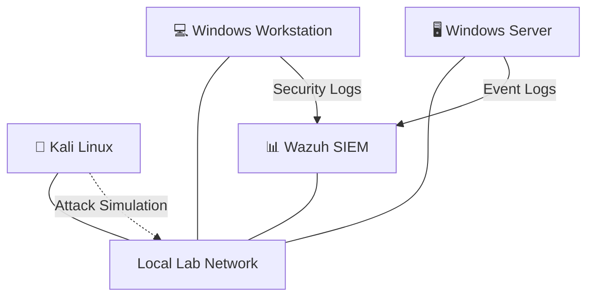

# 🛡️ Home SOC & Detection Lab

### 🧠 Cybersecurity Training Environment

Tento projekt dokumentuje stavbu a provoz **domácího bezpečnostního labu**, který slouží pro simulaci útoků, analýzu logů a nastavování detekčních pravidel v SIEM.

Lab je vytvořen pro trénink dovedností potřebných pro roli **SOC Analyst / Blue Team** – zejména:

* detekci podezřelých aktivit
* analýzu bezpečnostních logů
* práci se SIEM platformou
* simulaci útoků v kontrolovaném prostředí

---

# 🏗️ Lab Architecture

Virtuální prostředí obsahuje útočný stroj, pracovní stanici, serverovou infrastrukturu a centrální SIEM pro monitoring a analýzu logů.



---

# 🧩 Lab Components

### 🥷 Kali Linux

Simulace útoků a bezpečnostní testování.

### 💻 Windows Workstation

Generování telemetrie a testování detekčních pravidel.

### 🖥️ Windows Server

Serverová infrastruktura a zdroj bezpečnostních logů.

### 📊 Wazuh SIEM

Centrální sběr logů, monitoring bezpečnostních událostí a alerting.

---

# 🔧 Technologies

* VMware
* Kali Linux
* Windows
* Wazuh SIEM
* Sysmon
* Nmap
* Atomic Red Team

---

# 🧪 What I Practice In This Lab

* attack simulation
* log analysis
* detection engineering
* SIEM monitoring
* security event investigation
* SOC workflows

---

# 📁 Repository Structure

```
home-soc-lab
│
├─ lab-environment
├─ detections
├─ investigations
└─ notes
```

---

# 🎯 Goal

Cílem tohoto projektu je budovat praktické zkušenosti v oblasti **Security Operations (SOC)**, detekce hrozeb a analýzy bezpečnostních incidentů.

Projekt slouží jako součást mého **cybersecurity learning portfolia**.


Cílem tohoto projektu je postupně budovat praktické zkušenosti v oblasti Security Operations (SOC), detekce hrozeb a analýzy bezpečnostních událostí.

Projekt slouží jako součást mého cybersecurity learning portfolia.
